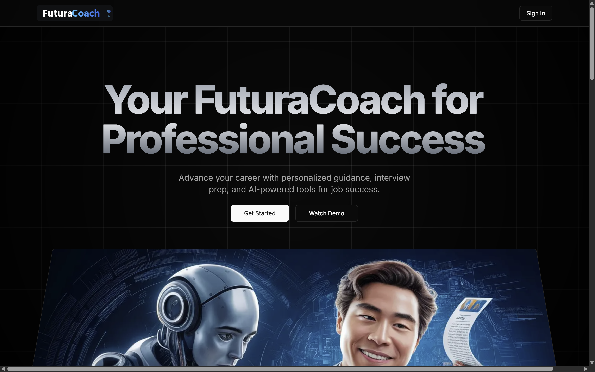

<div align="center">
  
  <h1>FuturaCoach</h1>
  <p>
    <b>Your AI-Powered Career Coach</b><br>
    Advance your career with personalized guidance, interview prep, and AI-powered tools for job success.
  </p>
  <a href="https://ai-career-coach-navy.vercel.app/">Live Demo</a> •
  <a href="https://github.com/Hmtgit7/ai-career-coach">Source Code</a> •
  <a href="https://hemant-gehlod.netlify.app/">Portfolio</a>
</div>

---

## 🚀 About the Project

**FuturaCoach** is a full-stack AI-powered career coaching platform built with Next.js, React, Tailwind CSS, Prisma, NeonDB, Clerk authentication, Inngest, and Gemini AI.  
It helps users accelerate their career growth with smart resume building, AI-generated cover letters, personalized interview prep, and real-time industry insights.

---

## ✨ Features

- **AI-Powered Career Guidance:** Get personalized career advice and insights powered by advanced AI.
- **Smart Resume Builder:** Instantly generate ATS-optimized resumes tailored to your industry and experience.
- **Cover Letter Generator:** Create compelling, job-specific cover letters in seconds.
- **Interview Preparation:** Practice with role-specific questions and get instant feedback to improve your performance.
- **Industry Insights:** Stay ahead with real-time trends, salary data, and market analysis.
- **Performance Analytics:** Track your progress and identify areas for improvement.
- **Secure Authentication:** User accounts and data are protected with Clerk.
- **Modern UI:** Built with Shadcn UI and Tailwind CSS for a beautiful, responsive experience.

---

## 🖼️ App Preview


> **Live Demo:** [ai-career-coach-navy.vercel.app](https://ai-career-coach-navy.vercel.app/)

---

## 🛠️ Tech Stack

- **Frontend:** React 19, Next.js 15, Tailwind CSS, Shadcn UI
- **Backend:** Next.js API Routes, Prisma ORM, NeonDB
- **AI:** Gemini AI (Google Generative AI)
- **Authentication:** Clerk
- **Background Jobs:** Inngest
- **Deployment:** Vercel

---

## 📚 How It Works

1. **Professional Onboarding:** Share your industry and expertise for personalized guidance.
2. **Craft Your Documents:** Create ATS-optimized resumes and compelling cover letters.
3. **Prepare for Interviews:** Practice with AI-powered mock interviews tailored to your role.
4. **Track Your Progress:** Monitor improvements with detailed performance analytics.

---

## 📝 Getting Started

### 1. Clone the repository

```bash
git clone https://github.com/Hmtgit7/ai-career-coach.git
cd ai-career-coach
```

### 2. Install dependencies

```bash
npm install
```

### 3. Set up environment variables

Create a `.env` file in the root directory and add the following:

```env
DATABASE_URL=
NEXT_PUBLIC_CLERK_PUBLISHABLE_KEY=
CLERK_SECRET_KEY=
NEXT_PUBLIC_CLERK_SIGN_IN_URL=/sign-in
NEXT_PUBLIC_CLERK_SIGN_UP_URL=/sign-up
NEXT_PUBLIC_CLERK_AFTER_SIGN_IN_URL=/onboarding
NEXT_PUBLIC_CLERK_AFTER_SIGN_UP_URL=/onboarding
GEMINI_API_KEY=
```

### 4. Run the development server

```bash
npm run dev
```

Open [http://localhost:3000](http://localhost:3000) to view the app.

---

## 📸 Screenshots

| Dashboard Preview | Resume Builder | Interview Prep |
|-------------------|---------------|---------------|
|  |  |  |

---

## 🙋‍♂️ About the Author

**Hemant Gehlod**  
🧑🏼‍💻 Full-Stack Developer | MERN & Java | Cloud & DevOps Enthusiast  
[Portfolio](https://hemant-gehlod.netlify.app/) • [GitHub](https://github.com/Hmtgit7)

---

## ⭐️ Why FuturaCoach?

- Built from scratch with modern full-stack technologies.
- Real AI integration for career tools (not just a template!).
- Clean, scalable codebase and best practices.
- Beautiful, responsive UI.
- Perfect for your resume, portfolio, or as a learning resource.

---

## 📄 License

This project is open source and available under the [MIT License](LICENSE).

---

<div align="center">
  <b>Made with ❤️ by Hemant Gehlod</b>
</div>
